VMware Advanced Customer Engagements (ACE) Team   
Authored by Riaz Mohamed & Raghu Pemmaraju

May 2020

Table of Contents 
=================

[Introduction](#introduction)

[Usecase](#use-case)

[Traffic flows](#traffic-flows)

[Assumptions](#assumptions)

[K8s Resources](#k8s-resources)

[Pod Definition](#pod-definition)

[Deployments And Services](#deployments-and-services)

[K8s Resource Deployments](#k8s-resource-deployments)

[K8 Deployments](#k8-deployments)

[Current Traffic Flow](#current-traffic-flow)

[Configure Micro Segmentation with NSX-T](#configure-micro-segmentation-with-nsx-t)

[Test Traffic Flow 24](#test-traffic-flow)

Introduction
============

In this document, we provide an overview on NSXT micro segmentation to
control traffic flows between services .

This document simulates a typical DMZ cluster where traffic flow is
controlled. Any ingress into the cluster is serviced by a pod running in
namespace x1 (typically this would be an ingress controller like
nginx/contour)

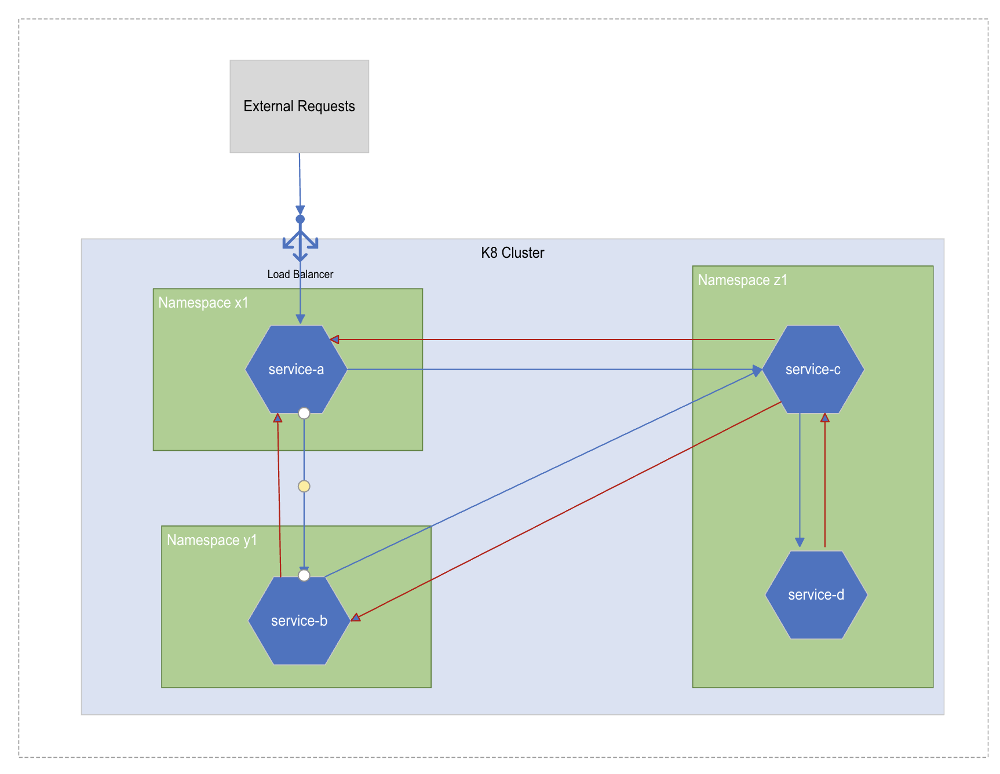  

Use-case 
========

The k8s cluster has three namespaces (namespace x1, y1 and z1). All
ingress into the cluster is restricted to namespace x1 and pod
service-a.

Namespace y1 runs a pod service-b and namespace z1 runs pods service-c
and service-d.

Traffic flows
-------------

All ingress traffic into the cluster can only be serviced by service-a
on namespace x1

Service-b allows traffic from service-a

Service-b denies traffic from service-c

Service-c allows traffic from service-a and service-b

Service-d allows traffic from only service-c

Service-c denies traffic from service-d

Assumptions
-----------

K8s cluster exists

K8s Resources
=============

Pod Definition
--------------

We will be using a pod definition with 2 containers

-   nginx (to service web requests)

-   busybox with curl (container to test service to service traffic)

Deployments And Services
------------------------

Service-a , service-b, service-c and service-d are identical and run the
above pod definition on their respective namespaces, they run two
replicas and are exposed as services srv-service-a, srv-service-b,
srv-service-c, srv-service-d

K8s Resource Deployments
========================

This section goes through the steps to set up the K8 environment with
the deployments in their respective namespaces. At the end of the setup
a test will be performed to establish that the there is traffic flow
between the different services deployed

K8 Deployments
--------------

1.  **Login to k8s cluster**

> pks login -a \<pks-api\> -u \<pksuser\> -p \<pks-password\> -k
>
> Eg.
>
> pks login -a pks.corp.local -u pksadmin -p VMware1! -k

2.  **Get Kubeconfig**

> pks get-kubeconfig \<cluster-name\> -a \<pks-api\> -u \<pksuser\> -p
> \<pks-password\> -k
>
> Eg.
>
> pks get-kubeconfig ci-cluster -a pks.corp.local -u pksadmin -p
> VMware1! -k

3.  **Change context**

> kubectl config use-context ci-cluster

4.  **Create Namespace x1, y1, z1**

> kubectl create ns x1
>
> kubectl create ns y1
>
> kubectl create ns z1
>

5.  **Check if namespace is created**

> kubectl ge ns
>
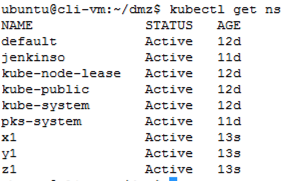

6.  **Create Deployments & Services**

Download the yaml file or copy contents to a local file Eg. micro.yaml . This file declares the K8 resources required . Create the necessary
resources in their respective namespaces

[https://github.com/riazvm/nsxtk8smicrosegmentation/blob/master/yaml/micro.yaml](https://github.com/riazvm/nsxtk8smicrosegmentation/blob/master/yaml/micro.yaml)
>
> kubectl apply -f micro.yaml
>
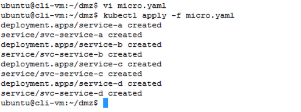

7.  **Check services and pods created in each namespace**

> kubectl get all -n x1
>

>
> kubectl get all -n y1
>

>
> kubectl get all -n z1
>
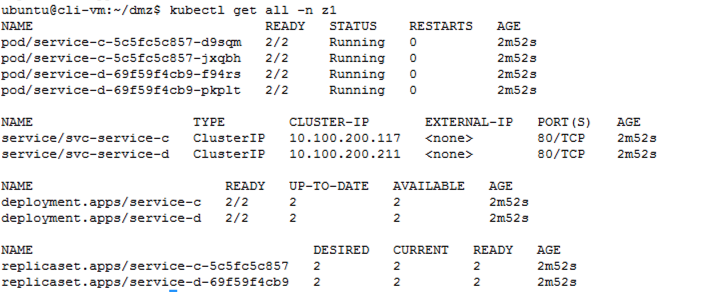

8.  **Expose service-a as a load-balancer service**

> kubectl expose deployment service-a \\
> \--name=service-a-lb \--port=80 \--target-port=8080
> \--type=LoadBalancer \--namespace=x1

9.  **Check the external URL/IP address assigned to the service (make
    note of the first IP addres under External-IP).**

> kubectl get svc -n x1
>
> 

Current Traffic Flow
--------------------

**Traffic flow from external network to k8 cluster**.

Open a browser and browse to the external ip from the previous step

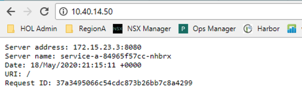

service-a can be reached from the external network through the load
balancer which is created in NSX-T

service-b, service-c and service-d are not exposed and hence are not
reachable from the external network.

**Traffic flow between pods**

We will be using the busy-box container within service-a pod and use
curl to check for responses between service.

Source Service -- service-a (namespace x1)

Target Service -- service-b (namespace y1)

1.  Get pods running on namespace x1

kubectl get po -n x1

> 

2.  Get service name for service-b running on namespace y1

> kubectl get svc -n y1\
> \
> 

3.  Exec into the busybox container running on a service-a pod

> kubectl exec -n \<namespace\> \<podname\> -it -c busybox \-- /bin/sh
>
> Eg
>
> kubectl exec -n x1 service-a-84965f57cc-nhbrx -it -c busybox \--
> /bin/sh
>
> 

4.  Use curl to reach service-b in namespace y1

> curl <http://svc-service-b.y1>
>
> NOTE: the service name is prepended by svc in this case, this is
> defined in the yaml we used to create the K8 resources. The service
> name is also appended by the namespace.

5.  This results in a successful response

6.  Use the curl command to check the service response of service-d in
    namespace z1

curl <http://svc-service-d.z1>

This should be successful as well

At this point all services should be able to communicate to each other.
The only traffic allowed from outside the cluster is to service-a via
the loadbalancer.

Configure Micro Segmentation with NSX-T
=======================================

This section goes through the configuration of NSX-T DFW rules that are
required to allow, restrict or drop pod to pod traffic.

1.  **Check labels on the pods**

> kubectl get pod \--show-labels -n x1

Check the labels on the pods in namespace y1 and z1 as well

> 

2.  **Check tags for pods in NSXT**

Login to NSXT and Navigate to Advanced Networking & Security Switching
Ports

> The pods service-a , service-b, service-c and service-d would have a
> logical port assigned to them
>
> 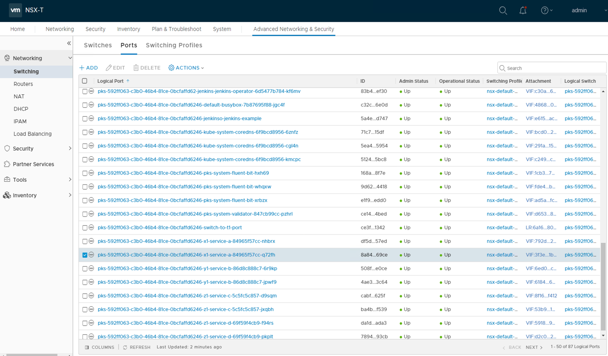

> Click on one of the Logical ports associated with the services we are
> working with and notice that the tags on NSXT is the labels defined
> for the pods in K8s.

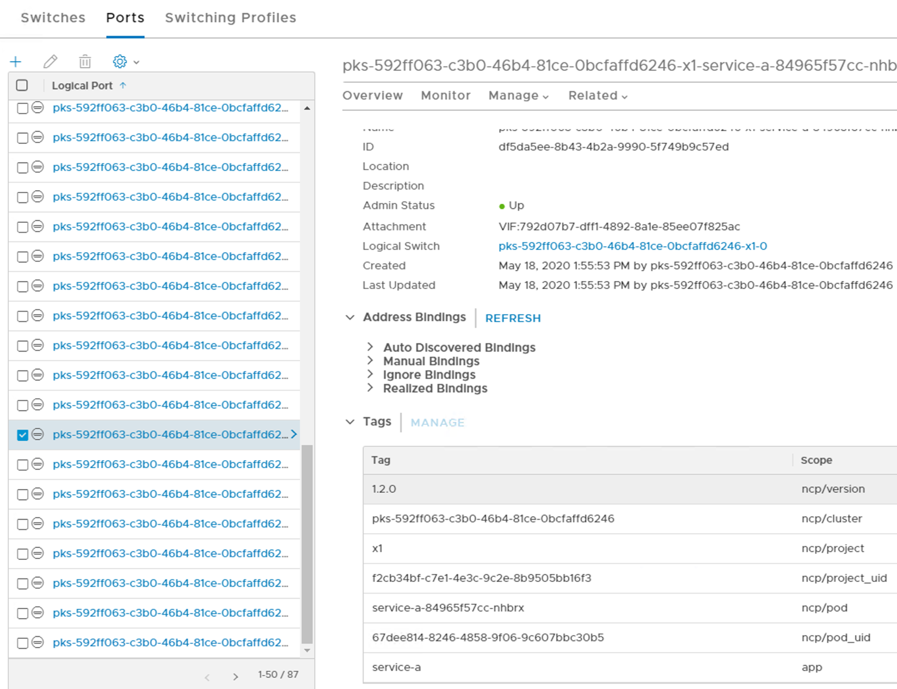

3.  **Create NSX-T NSGroup (NSX-T Security Group)**

> Login to NSXT and Navigate to Advanced Networking & Security Inventory
> Groups
>
> 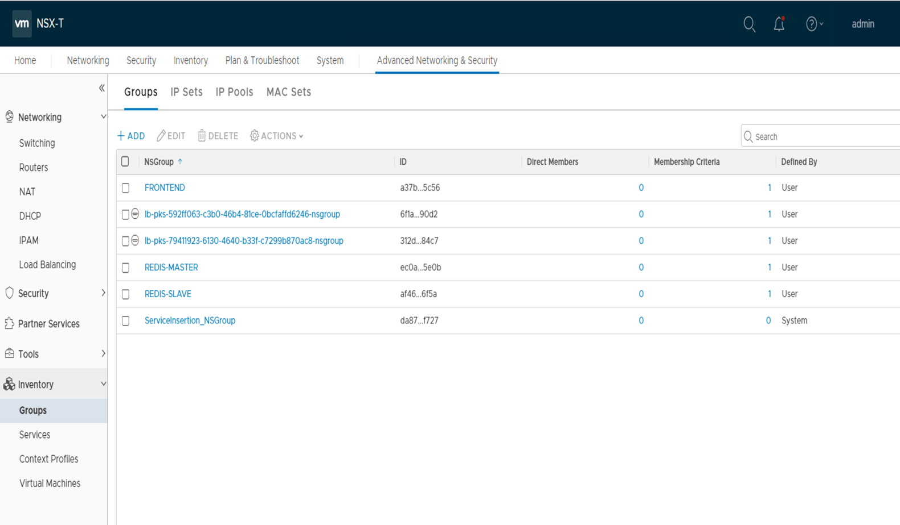
>
> Create a new NSGroup by clicking on ADD
>
> Create an NSGroup for service-a
>
> NSGroup name -- nsg-service-a
>
> 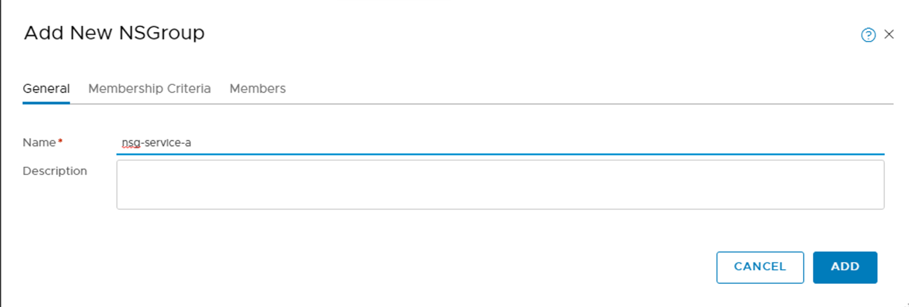
>
> Click on Membership Critera
>
> And add the following criteria
>
> Logical Port \> Tag \> Equals \> service-a \> Scope \> equals \> app
>
> Note this are the values of the tag retrieved in step 2.
>
> 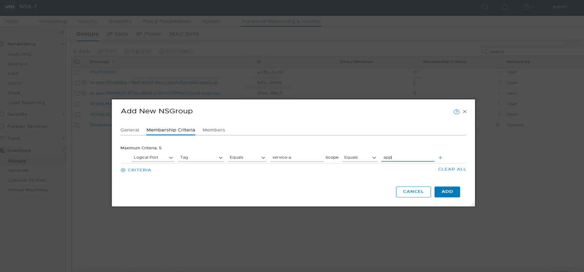

Repeat the same to create NSGroups for service-b, service-c and
service-d

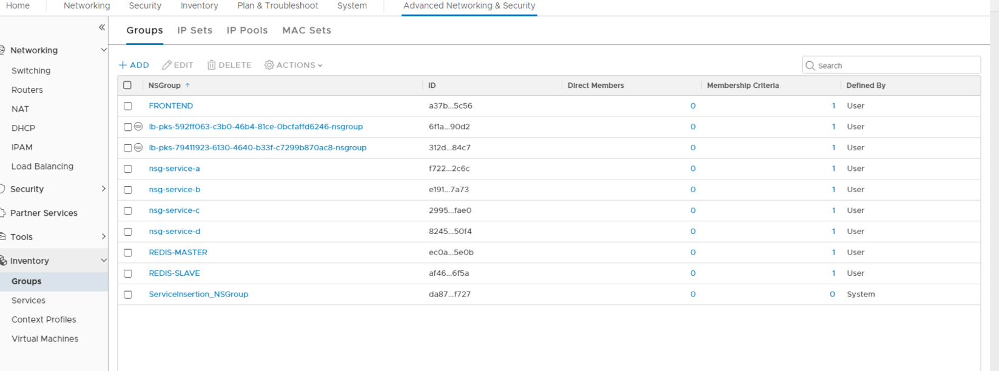

4.  **Check for pool members**

> Click on the newly created groups and select Members , check IP
> addresses
>
> 
>
> Run the following kubectl command from the terminal to verify that the
> ip-address match the pods ip addresses
>
> kubectl get po -n x1 -o wide

> Repeat the same for the other NSGroups created

5.  **Create DFW rules**

> Login to NSXT and navigate to Advanced Networking & Security Security
> Distributed Firewall
>
> 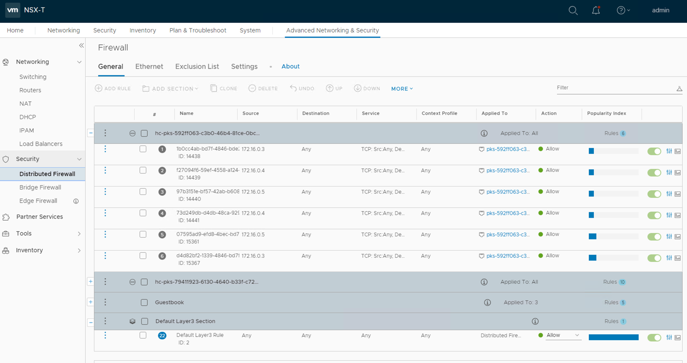
>
> Select the first section listed and navigate to ADD SECTION Add
> Section Above
>
> 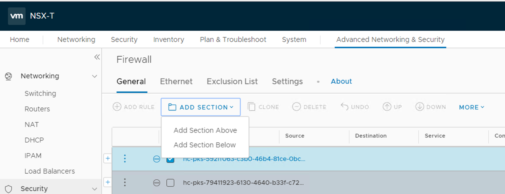
>
> Section Name -- PtoPDFW-MicroSegmentation
>
> Object Type -- NSGroup
>
> Select -- nsg-service-b, nsg-service-c and nsg-service-d
>
> 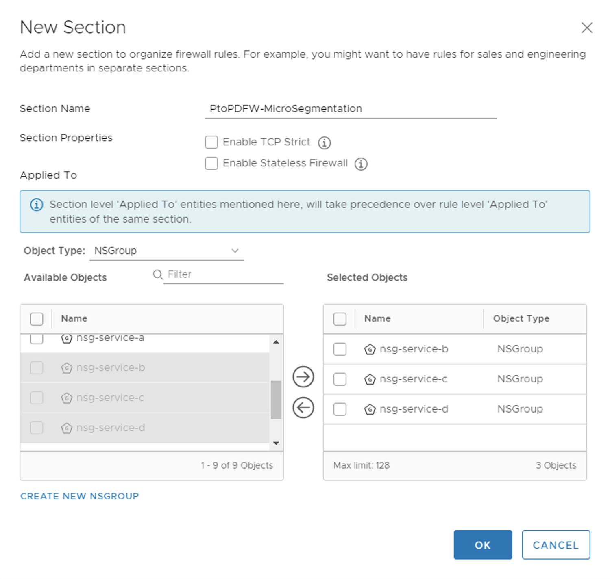
>
> Select the newly created PtoPDFW-MicroSegmentation segment and click
> on Add rule

Rule 5:

> ID : DenyAll
>
> Source : Any
>
> Destination: Any
>
> Service: Any
>
> ContextProfile: Any
>
> Action : Reject
>
> Rule 4:
>
> ID : service-aToservice-b
>
> Source : nsg-service-a
>
> Destination: nsg-service-b
>
> Service: Any
>
> ContextProfile: Any
>
> Action : Allow
>
> To select the Source click on the icon next to the source filed and
> click on Edit Rule Source
>
> 
>
> Select Object Type as NSGroup
>
> 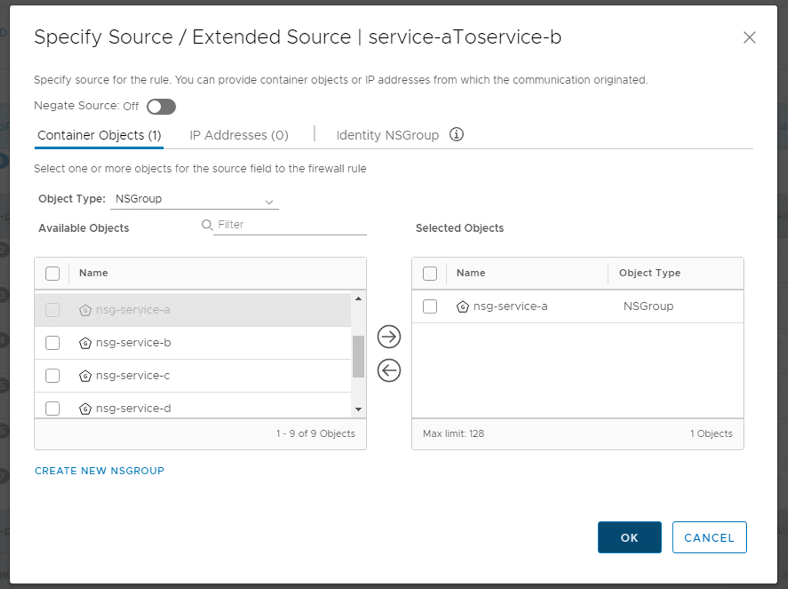
>
> Similarly select nsg-service-b for destination.
>
> 
>
> Rule 3:
>
> ID : service-aToservice-c
>
> Source : nsg-service-a
>
> Destination: nsg-service-c
>
> Service: Any
>
> ContextProfile: Any
>
> Action : Allow
>
> Rule 2:
>
> ID : service-bToservice-c
>
> Source : nsg-service-b
>
> Destination: nsg-service-c
>
> Service: Any
>
> ContextProfile: Any
>
> Action : Allow
>
> Rule 1:
>
> ID : service-cToservice-d
>
> Source : nsg-service-c
>
> Destination: nsg-service-d
>
> Service: Any
>
> ContextProfile: Any
>
> Action : Allow

> Select PtoPDFW-Microsegmentation and click on Publish

Test Traffic Flow
=================

**Traffic flow from external network to k8 cluster**.

Open a browser and browse to the external ip from the previous step

service-a can be reached from the external network through the load
balancer which is created in NSX-T

service-b, service-c and service-d are not exposed and hence are not
reachable from the external network.

**Traffic flow between pods**

We will be using the busy-box container within service-a pod and use
curl to check for responses between service.

  **Source Pod**   **Destination Pod**   **Result**
  ---------------- --------------------- ------------
  service-a        service-b             Success
  service-a        service-c             Success
  service-a        service-d             Fail
  service-b        service-c             Success
  service-b        service-d             Fail
  service-c        service-d             Success
  service-c        service-b             Fail
  service-d        service-c             Fail
  service-d        service-b             Fail

1.  Get pods running on namespace x1

kubectl get po -n x1

> 

2.  Get service name for service-b running on namespace y1

> kubectl get svc -n y1\
> \
> 

3.  Exec into the busybox container running on a service-a pod

> kubectl exec -n \<namespace\> \<podname\> -it -c busybox -- /bin/sh
>
> Eg
>
> kubectl exec -n x1 service-a-84965f57cc-nhbrx -it -c busybox -- /bin/sh
>
> 
>
> Use curl to reach service-b in namespace y1
>
> curl <http://svc-service-b.y1>
>
> NOTE: the service name is prepended by svc in this case, this is
> defined in the yaml we used to create the K8 resources. The service
> name is also appended by the namespace.

4.  This results in a successful response

5.  Use the curl command to check the service response of service-c in
    namespace z1

curl <http://svc-service-c.z1>

This should be successful as well

6.  Use the curl command to check the service response of service-d in
    namespace z1

curl <http://svc-service-d.z1>

> This would fail

Exec into each pod and check connectivity between pods.
